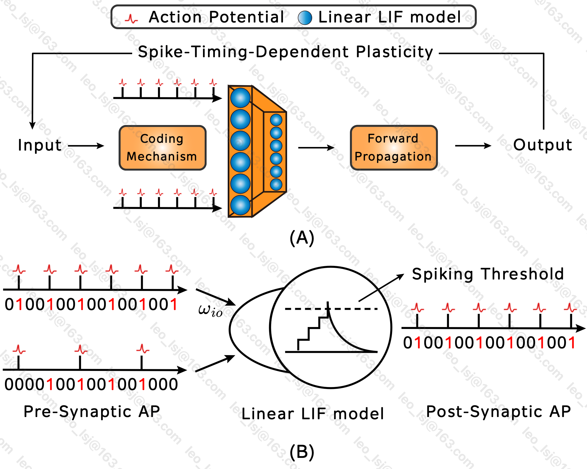

#! https://zhuanlan.zhihu.com/p/666392319
# 脉冲神经网络

## 1. 脉冲神经网络简介

### 1.1 什么是脉冲神经网络？

脉冲神经网络被称作是**第三代神经网络**。不同于传统的神经网络，脉冲神经网络通过脉冲序列来传递以及处理信息，精细地模拟了神经元的**活动状态**以及生物神经系统中神经元之间的**信息传递方式**。在一些特定应用，例如时间序列分析、计算机视觉等领域具有其独特的优势。同时因为其生物可解释性以及鲁棒性，脉冲神经网络被认为是通往通用人工智能的有效路径。

脉冲神经网络是一种基于生物神经元行为的人工神经网络。它的特点是使用脉冲信号来传递信息，而不是像传统神经网络那样使用连续的信号。这种网络结构可以模拟人类大脑中的神经元行为，因此在处理模式识别、分类、控制等问题时具有很好的性能。

脉冲神经网络的基本单元是脉冲神经元，它由输入、输出、阈值和脉冲发放机制组成。当输入信号超过阈值时，神经元会发出一个脉冲信号，这个信号会传递到其他神经元中，从而实现信息的传递和处理，如下图A中所示。脉冲神经网络的训练方法主要有监督学习和无监督学习两种，其中无监督学习方法包括Hebbian学习、STDP学习等。

脉冲神经网络中最常用的神经元模型是Leaky Integrate-and-Fire（LIF）模型，突触前和突触后的脉冲序列可以使用[0,1]构成的向量来表示，如下图B所示。在脉冲神经网络中，神经元之间的连接可以是全连接、局部连接或者随机连接。而探究LIF模型的细节，则是膜电位的变化过程。

### 1.2 脉冲神经网络的历史和发展

SNN的发展起源于上个世纪90年代，在这个过程中取得了许多重大的进展。1907年，Louis Lapicque提出了泄漏整合发放模型（Leaky Integrate-and-Fire model, LIF）。LIF模型的提出为理解脉冲神经元的动力学性质奠定了基础，并在后期的研究中得到了广泛的应用。对于更好地模拟生物神经元的工作机制以及SNN的设计与构建有着重要的影响。

1949年，Donald Hebb提出了Hebb学习算法，是一种典型的无监督学习算法。Hebb学习算法为神经网络领域的进一步研究奠定了基础。1952年，Alan Hodgkin和Andrew Huxley提出了Hodgkin Huxley（HH）模型，对动作电位背后的生物物理机制提供了更为复杂的理解。该模型由四个偏微分方程组成，可以精确建模生物神经元的离子通道，并计算膜电位的变化。该模型为神经信息处理的理论研究奠定了基础，对于神经生物学和计算神经科学有着深远的影响。1998年，Bi，G.Q.和Poo，M.M提出了脉冲时刻依赖可塑性学习算法，该算法成为SNN最广泛使用的学习算法之一。STDP利用尖峰的时间来调整神经元之间的突触权重，从而产生更具生物学意义的学习规则。1999年，Wolfgang Maas在之前的研究基础上第一次提出了脉冲神经网络的概念。

脉冲神经网络被提出后，其网络结构经历了多层次的变化。2007年，T.e Masquelier依据灵长类动物视觉的多层网络结构提出了一个浅层脉冲神经网络。该网络仅有一层脉冲神经元组成。浅层脉冲神经网络通过与边缘检测等结合，在目标分类任务中取得了良好的效果。2015年，Diehl提出了一个具有全连接层结构的SNN，从而开发了可以在大型数据集上训练的更复杂的脉冲神经网络模型。2017年，Kheradpsheh提出了一种由STDP训练的具有卷积层的脉冲神经网络。这一突破允许将SNN用于计算机视觉任务，为SNN在实际应用中开辟了一个新的可能性领域。然后提出了基于VGG和ResNet的SNN，进一步推进了SNN的领域及其实际应用。

在学习算法方面，脉冲神经网络的训练可以分为有监督和无监督，其中无监督学习算法主要为STDP。2015年，Cao提出了ANN2SNN算法，该算法允许将人工神经网络转换为脉冲神经网络，从而使脉冲神经网络能够用于实际应用。2016年，Wu提出了一种名为STBP的监督学习算法，该算法通过提供一种更有效的训练脉冲神经网络的方式，进一步推动了脉冲神经网络领域的发展。

### 1.3 脉冲神经网络的应用

脉冲神经网络的应用非常广泛，包括图像识别、语音识别、控制系统、机器人控制等领域。它在处理非线性、非平稳、高噪声的信号时具有很好的鲁棒性和适应性。

[脉冲神经网络的应用 Spiking Neural Networks and Their Applications: A Review](https://www.ncbi.nlm.nih.gov/pmc/articles/PMC9313413/) [^1]

## 2. 脉冲神经元
- 脉冲神经元的结构和特点
- 脉冲神经元的工作原理
- 脉冲神经元的数学模型

## 3. 脉冲神经网络的基本结构
- 脉冲神经网络的层次结构
- 脉冲神经网络的连接方式
- 脉冲神经网络的训练方法

## 4. 脉冲神经网络的应用
- 脉冲神经网络在模式识别中的应用
- 脉冲神经网络在控制系统中的应用
- 脉冲神经网络在机器人控制中的应用

## 5. 脉冲神经网络的发展趋势
- 脉冲神经网络的发展历程
- 脉冲神经网络的未来发展方向
- 脉冲神经网络与其他人工智能技术的结合

## 6. 参考文献

[^1] Yamazaki K, Vo-Ho VK, Bulsara D, Le N. Spiking Neural Networks and Their Applications: A Review. Brain Sci. 2022 Jun 30;12(7):863. doi: 10.3390/brainsci12070863. PMID: 35884670; PMCID: PMC9313413.